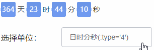
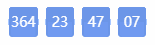

# vue-flip-down  [](https://www.npmjs.com/package/vue-flip-down) [](https://www.npmjs.com/package/vue-flip-down)


这是一个简单的翻页倒计时vue组件，项目中有用到，所以提取了一下。<br/>
你们也可以直接把`src/app.vue`文件拷贝到项目里直接用，就是个普通vue组件，就不用`npm install` 了

### 示例


### 在线DEMO
<a href="https://isluo.com/work/vue-filp-down/" target="_blank">https://isluo.com/work/vue-filp-down/</a>


### 安装
```
npm install vue-flip-down --save
```
或
```
yarn add vue-flip-down 
```

### 使用
```vue
import FlipDown from 'vue-flip-down';

<FlipDown
  :endDate="1540212399971"  // 倒计时截止的日期
  @timeUp="func"            // 时间到了会触发timeUp事件
/>
```

### 参数

| 名称    | 类型        | 默认 | 描述                                                                                  |
| ------- | ----------- | ---- | ------------------------------------------------------------------------------------- |
| endDate | Date/Number | 0    | 结束的时间，即倒计时会从当前时间一直到endDate停止，可以是一个日期对象，也可以是毫秒数 |
| type    | Number      | 4    | 要怎么显示倒计时：4-日时分秒，3-时分秒，2-分秒，1-秒                                  |
|theme|Number|1|样式：1-合并，2-分离。见下图|
|timeUnit|Array|\[\]|时间单位，显示在空隙之间的文字，比如：\['天','时','分','秒'\] 或 \[':',':',':'\]|

#### :theme="1" 合并式


> 合并式的，每个不同的时间单位是合在一起的

#### :theme="2" 分离式


> 分离式的，每个数字都是单独分开的

### 事件
| 名称   | 返回值 | 描述                                    |
| ------ | ------ | --------------------------------------- |
| timeUp | null   | 当倒计时走到0时会触发一次，表示时间到了 |


### 说明

* 内部使用了setTimeout，当倒计时结束后，就会停止循环。但可以动态改变日期，倒计时又会被激活。
* 基于本地时间做对比
